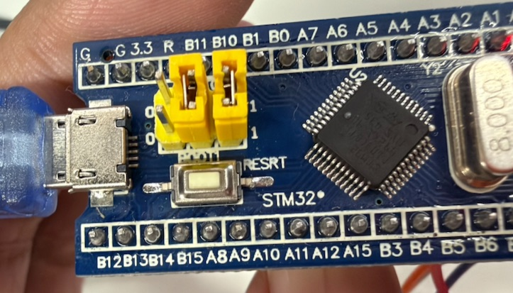

# SerialStride Legbot

> 从单电机台架开始，逐步完成一台桌面级串联轮腿机器人。
>
> An open development journal for a desktop-scale serial wheel-legged robot,
> progressing from motor bring-up to standing, driving, and jumping.



上图是早期 STM32F103 临时台架主控。完整底盘仍在持续装配和验证中。

## 当前阶段

**`v0.1.0` H6215 单电机台架已完成。**

- STM32F103、TJA1050 与 DM-H6215 已建立 1 Mbps CAN 通信。
- 已验证参数读取、正反转、连续速度控制和反馈解析。
- 已实现速度斜坡、串口看门狗、温度/速度保护及自动失能。
- 已验证固件通过 GitHub Release 发布，原始串口记录保存在仓库中。

下一阶段：

1. 将已验证的 CAN 驱动和保护逻辑迁移到达妙 MC02。
2. 接入第二台 H6215，验证左右轮 ID、方向和同步控制。
3. 在可靠支撑和严格限矩条件下验证力矩控制。

## 项目目标

SerialStride Legbot 的长期目标是一台主要由 3D 打印件和低成本机加工件
构成的桌面级串联轮腿平台，用于学习和验证：

- 嵌入式实时控制与 CAN 总线；
- 串联腿运动学、雅可比和 VMC；
- 两轮自平衡、LQR 和状态估计；
- 变高度、行驶、转向及低高度跳跃。

## 当前硬件

| 模块 | 当前配置 |
|---|---|
| 轮毂电机 | 达妙 DM-H6215 |
| 临时主控 | STM32F103C8T6 Blue Pill |
| 计划主控 | 达妙 MC02 |
| CAN 收发器 | TJA1050 模块 |
| 台架供电 | 24 V 直流电源 |
| 调试接口 | CH340 USB-TTL, 115200 8N1 |

## 仓库结构

```text
firmware/   嵌入式固件和控制器代码
hardware/   CAD、电气设计、BOM 和制造资料（有内容时创建）
simulation/ 动力学与控制仿真（有内容时创建）
tools/      自编写的日志、CAN 和绘图工具（有内容时创建）
docs/       bring-up 教程、进展记录和设计笔记
assets/     README 使用的压缩图片
```

H6215 台架入口：

- [固件说明](firmware/stm32f103-h6215-bench/README.md)
- [接线与已确认参数](docs/bring-up/h6215-single-motor/硬件接线与参数.md)
- [首次调通记录](docs/progress/2026-07-29_H6215单电机调通.md)

## 版本路线

| 版本 | 里程碑 |
|---|---|
| `v0.1.0` | H6215 单电机台架 |
| `v0.2.0` | 单腿运动 |
| `v0.3.0` | 首次站立 |
| `v0.4.0` | 首次行驶 |
| `v0.5.0` | 首次跳跃 |
| `v1.0.0` | 可运行原型 |

日常修改通过 Git commit 保存，实验使用 `feat/`、`fix/`、
`experiment/`、`mechanical/` 或 `docs/` 分支。工作目录不使用
`_v1`、`最终版`等文件名保存历史。

## 安全

轮毂电机和关节电机可能在瞬间产生危险运动。台架测试时必须固定电机定子、
保持转子悬空、设置软件限幅，并将 24 V 物理断电开关放在触手可及的位置。
软件失能不能代替物理断电。

## 授权

本仓库不是整体采用同一种许可证：

- 原创代码使用 [MIT License](LICENSES/MIT.txt)。
- CAD、STEP、图纸及其他硬件资料当前为 **All Rights Reserved**。
- 文档、日志和媒体资料默认保留版权。

仓库公开可见不代表硬件设计已获得开源、复制、制造或商用授权。完整范围见
[LICENSE](LICENSE)。
